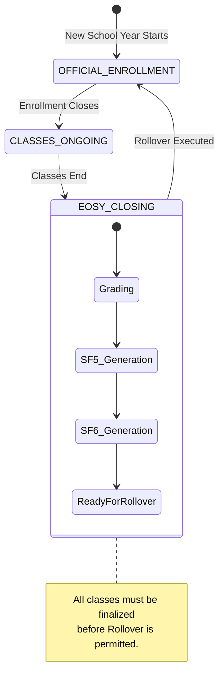

# School Year Rollover Documentation

This document explains how the EnrollPro system transitions from the End of School Year (EOSY) to the Beginning of School Year (BOSY). It serves as a comprehensive guide for developers (focusing on DB schema, APIs, and data state) and school administrators (focusing on system phases and compliance).

## 1. Executive Summary & System Academic Phases

The transition between school years is a one-way, highly-guarded state change that archives historical data and provisions fresh structures for the upcoming year.

The system strictly follows three cyclical **System Academic Phases**:

1. **`OFFICIAL_ENROLLMENT`**: The initial registration period. Learners submit forms, registrars verify them, and sectioning occurs.
2. **`CLASSES_ONGOING`**: The active academic period. Focus shifts to attendance, class records, and daily operations.
3. **`EOSY_CLOSING`**: The finalization period. Grades are published, School Forms (SF5, SF6) are generated, and learners are tagged with final academic outcomes (Promoted, Retained, etc.).

> [!CAUTION]
> A School Year Rollover can **only** occur when the current year is in the `EOSY_CLOSING` phase, all classes have finalized their grades, and all School Forms (SF5 and SF6) are recorded.

## 2. Pre-Rollover Blockers & Validation

The system enforces strict data integrity before permitting a rollover. The validation logic (`getReadiness`) scans the active database for unresolved states.

### Common Rollover Blockers

| Blocker Code | Description | Resolution |
| :--- | :--- | :--- |
| `SECTION_NOT_FINALIZED` | A class section has not locked its final grades (SF5). | The Class Adviser must finalize the section in their EOSY Dashboard. |
| `SMART_OUTCOME_MISSING` | A learner lacks a final grade from the SMART grading module. | The Registrar must sync or manually override the grading outcome. |
| `SF5_NOT_RECORDED` / `SF5_STALE` | School Form 5 is missing or outdated relative to recent grade changes. | Generate and lock the final SF5. |
| `CALENDAR_POLICY_NOT_APPROVED` | The next school year's calendar policy is missing or not approved. | Admin must approve the DepEd Calendar Policy for the target year. |

## 3. Historical Archiving: Freezing the Old Year

To comply with DepEd audit requirements, previous school year data is frozen rather than mutated or deleted.

### Step 1: The Historical Ledger (`EnrollmentHistory`)
During rollover, the active `EnrollmentRecord` table is flushed. For every active enrollment in the closing year, a permanent snapshot is created in the `EnrollmentHistory` table. This snapshot captures:
- The learner's profile state at that exact time.
- The section and class adviser.
- The final General Average (`genAve`) and EOSY Status (`PROMOTED`, `RETAINED`, etc.).
- A snapshot of the SMART academic outcomes.

### Step 2: Archiving the School Year & Sections
- The `SchoolYear` record is marked `status = ARCHIVED` and `isEosyFinalized = true`.
- The `SchoolYear.settingsSnapshot` captures the global configurations (e.g., whether STE/SPA programs were enabled) so historical views render correctly.
- All active `SectionAdviser` records for the closing year are marked `status = REVOKED`.

> [!NOTE]
> Once a School Year is `ARCHIVED`, any UI route tied to it operates in a strict "Historical Read-Only" mode.

## 4. Creation of the New School Year

With the old year archived, the system provisions the target year.

1. **Cloning the School Year (`clonedFromId`)**
   A new `SchoolYear` record is created. It explicitly references the old year via `clonedFromId` to maintain continuity.
   
2. **Applying the Calendar Policy**
   The system attaches the approved `SchoolYearCalendarPolicy` to the new year, defining critical dates like `classOpeningDate`, `enrollOpenDate`, and `termFormat`.

## 5. Transitioning Entities (Data Mapping)

The rollover script automates the creation of foundational data for the new year.

### Section Cloning

Sections are duplicated for the new year, but stripped of learners and advisers.

| Source Table (`Section` Year A) | Target Table (`Section` Year B) |
| :--- | :--- |
| `name` | Copied |
| `gradeLevelId` | Copied |
| `programType` (Regular, STE, etc.) | Copied |
| `isHomogeneous`, `isSnake` | Copied |
| `isEosyFinalized: true` | Reset to `false` |

### Learner Promotion Workflow

The most critical step is updating the `Learner` and creating their new `EnrollmentApplication`. The logic (`resolveRolloverDestination`) determines the learner's next step based on their `eosyStatus`.

| Current Status (Year A) | Target Grade (Year B) | Application Status (Year B) | Next Action |
| :--- | :--- | :--- | :--- |
| `PROMOTED` (Grade 7) | Grade 8 | `PENDING_CONFIRMATION` | Guardian must confirm enrollment intent for BOSY. |
| `RETAINED` (Grade 7) | Grade 7 | `PENDING_CONFIRMATION` | Guardian must confirm enrollment intent for BOSY. |
| `CONDITIONALLY_PROMOTED` | Next Grade Level | `REMEDIAL_HOLD` | Learner must pass remedial classes before confirmation is allowed. |
| `DROPPED_OUT` | N/A | (No Application Created) | Learner is archived. `Learner.status = DROPPED`. |
| `PROMOTED` (Grade 10) | N/A (JHS Completer) | (No Application Created) | Learner is archived. `Learner.status = JHS_COMPLETER`. |

> [!TIP]
> The auto-generated `EnrollmentApplication` inherits the learner's demographic data, addresses, and family members from Year A, bypassing the need for guardians to re-type all information.

### Personnel Designations

By default, `TeacherDesignation`s are **not** blindly copied. Teachers retain their `Teacher` profile, but the Head Registrar must manually assign Class Advisers to the newly cloned sections during the `OFFICIAL_ENROLLMENT` phase.

## 6. System Flow & Entity Diagrams

### Rollover State Machine



### Data Transition Flow

```mermaid
flowchart TD
    subgraph Year A (Active)
        A1[EnrollmentRecord]
        A2[Section]
        A3[Learner]
        A4[SectionAdviser]
    end

    subgraph Rollover Transaction
        R1(Archive to EnrollmentHistory)
        R2(Clone Section Structure)
        R3(Determine Promotion)
        R4(Revoke Adviserships)
    end

    subgraph Year B (New)
        B1[EnrollmentApplication]
        B2[Section (Empty)]
        B3[Learner (Updated)]
    end

    A1 --> R1
    A1 --> R3
    A2 --> R2
    A3 --> R3
    A4 --> R4

    R3 --> B1
    R2 --> B2
    R3 --> B3
```
