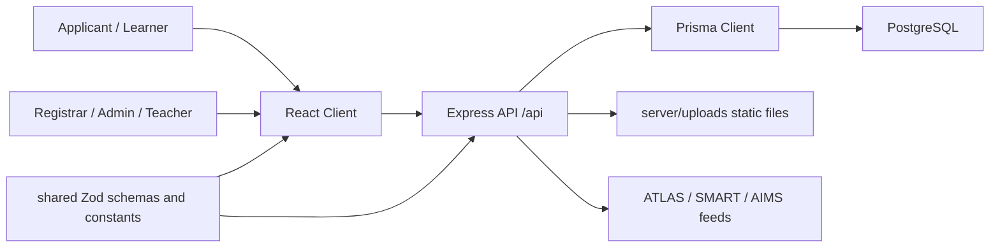

# System Overview

## Purpose

Describes the major system components and how they fit together.

## Summary

EnrollPro is a full-stack enrollment platform with a Vite React frontend, Express API server, Prisma/PostgreSQL database, shared Zod contracts, and public integration feeds for companion systems.

## Detailed Analysis

The API resolves school-year context globally for `/api` requests. Business modules cover admissions, enrollment, sectioning, students, teachers, BOSY, EOSY, audit logs, reading assessment, remedial processing, settings, and integrations.

## Dependencies

- `client/src`
- `server/src`
- `server/prisma/schema.prisma`
- `shared/src`

## Risks

- Cross-cutting school-year context can create surprising behavior for public reference routes if not carefully scoped.
- Uploads and generated files must be kept separate from source code.

## Recommendations

- Maintain one living architecture map in this note.
- Keep companion-system boundaries explicit in [[API Architecture]].

## Related Notes

- [[Frontend Architecture]]
- [[Backend Architecture]]
- [[Database Architecture]]
- [[API Architecture]]

