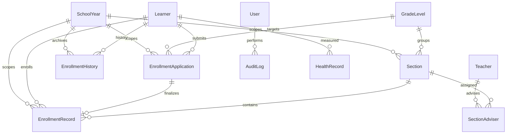

# ERD

## Purpose

High-level entity relationship diagram for the database.

## Summary

The data model centers on school-year-scoped learner enrollment, with canonical learner identity separated from yearly applications, official records, and historical outcomes.

## Detailed Analysis

## Dependencies

- `server/prisma/schema.prisma`
- [[Tables]]
- [[Relationships]]

## Risks

- Mermaid ERD is a simplified model and does not show every support table.

## Recommendations

- Regenerate this diagram after major schema changes.
- Add detailed cardinality notes for school-year lifecycle and sectioning.

## Related Notes

- [[Database Architecture]]
- [[Enrollment Workflow]]

