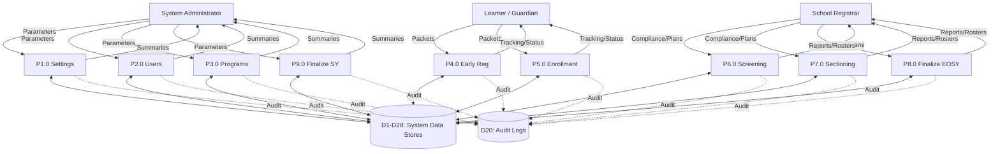

# EnrollPro - Data Flow Diagram (DFD) Guide

This document outlines the logical flow of information through the EnrollPro system. It maps the conceptual data stores to physical database models and describes the core processes for learners, registrars, and administrators within the Hinigaran National High School (HNHS) ecosystem.

---

## 1. Data Stores to Database Mapping (1-to-1)

The system utilizes the following data stores, each mapping exactly to a physical database table:

| ID | Data Store (Physical Table Name) | Description |
| :--- | :--- | :--- |
| **D1** | `users` | System login credentials and RBAC assignments. |
| **D2** | `teachers` | Teacher demographics and contact data. |
| **D3** | `school_settings` | Global UI identity (School Name, Logo, Accent Color). |
| **D4** | `school_years` | SY portal window dates and lifecycle statuses. |
| **D5** | `grade_levels` | Permanent global records defining JHS hierarchy. |
| **D6** | `sections` | Grade-level classes, capacities, and program typing. |
| **D7** | `section_advisers` | Historical ledger of section adviserships. |
| **D8** | `tle_programs` | Master list of TLE specialization tracks (Grades 9 & 10). |
| **D9** | `learners` | Permanent demographic records (Name, LRN, Birthdate). |
| **D10** | `early_registration_applications` | Phase 1 Early Registration SY-specific metadata. |
| **D11** | `early_registration_assessments` | Qualitative and quantitative assessment results. |
| **D12** | `enrollment_applications` | Phase 2 Official Enrollment (BEEF) intent. |
| **D13** | `enrollment_previous_schools` | Previous school credentials for SF10. |
| **D14** | `enrollment_program_details` | SCP track and strand specialization details. |
| **D15** | `application_addresses` | Current and Permanent geographic locations. |
| **D16** | `application_family_members` | Parent and Guardian profiles. |
| **D17** | `application_checklists` | Boolean flags for physical document submission. |
| **D18** | `enrollment_records` | The definitive student-to-section placement link. |
| **D19** | `departments` | Academic departments linked to faculty. |
| **D20** | `audit_logs` | Immutable trail of administrative and registrar actions. |
| **D21** | `health_records` | SF8 physical measurements (BMI, Height, Weight). |
| **D22** | `scp_program_configs` | SCP core admission formula and cutoff logic. |
| **D23** | `scp_program_steps` | Ordered assessment pipeline steps. |
| **D24** | `scp_interview_rubric_categories` | Dynamic rubric categories for assessments. |
| **D25** | `scp_interview_rubric_criteria` | Individual scoring criteria for rubrics. |
| **D26** | `scp_program_options` | Available SCP program variants and strands. |
| **D27** | `teacher_subjects` | Teacher subject specializations. |
| **D28** | `teacher_designations` | SY-scoped advisory and ancillary role assignments. |

---

## 2. Level 1 DFD: Sequential Lifecycle Processes (P1.0 - P9.0)

### Phase A: System Initialization (Admin)

- **P1.0 Configure School Settings:** Receives `[School Identity & SY Lifecycle Parameters]`. Reads `[Active Configuration]` from D3/D4. Outputs to D3, D4, and D20.
- **P2.0 Manage Users & Access:** Receives `[Personnel Credentials & Role Assignments]`. Reads from D1, D2, and D19. Outputs to D1, D2, D27, D28, and D20.
- **P3.0 Configure Special Programs:** Receives `[SCP Criteria & Rubrics]`. Reads from D22, D23. Outputs to D22, D23, D24, D25, D26, and D20.

### Phase B: Admission & Enrollment (Learner)

- **P4.0 Submit Early Registration:** Learner submits packet. Reads D4, D5. Outputs to D9, D10, D15, D16, and D20.
- **P5.0 Submit Official Enrollment:** Learner submits packet. Reads D4, D9, D15, D16, D8. Outputs to D12, D13, D14, and D20.
- **P5.1 Submit Continuing Learner Confirmation:** Learner submits intent. Reads D12. Outputs status to D12 and D20.
- **P5.2 Monitor Application Status & View Placement:** Reads D10, D12, D18, D6, D2. Returns dashboard view.

### Phase C: Verification & Placement (Registrar)

- **P6.0 Verify & Screen Applications:** Registrar inputs scores/flags. Reads D10, D22, D23, D17, D11. Outputs to D17, D10, D11, and D20.
- **P7.0 Manage Sectioning & Enrollment:** Registrar inputs plan. Reads D12, D9, D6, D4, D8. Outputs to D18, D12, D6, D7, and D20.

### Phase D: EOSY Finalization (Registrar/Admin)

- **P8.0 Finalize EOSY Promotional Status:** Registrar inputs data. Reads D9, D18, D6. Outputs to D18, D6, D21, and D20.
- **P9.0 Finalize School Year:** Admin inputs parameters. Reads D18, D6, D2, D9. Outputs to D4 and D20.

---

## 3. Visual DFD Level 1 (Standalone Overview)

