# EnrollPro - Data Flow Diagram (DFD) Guide

This document outlines the logical flow of information through the EnrollPro system. It maps the conceptual data stores to physical database models and describes the core processes for learners, registrars, and administrators within the Hinigaran National High School (HNHS) ecosystem.

---

## 1. Data Stores to Database Mapping

The system utilizes the following data stores, which map directly to our physical Prisma ORM models:

| ID      | Data Store Name          | Physical Database Tables (Prisma Models)                                                                                              | Description                                                                   |
| :------ | :----------------------- | :------------------------------------------------------------------------------------------------------------------------------------ | :---------------------------------------------------------------------------- |
| **D1**  | **Learner Profiles**     | `learners`                                                                                                                            | Permanent demographic records (Name, LRN, Birthdate, Mother Tongue).          |
| **D2**  | **Early Reg Apps**       | `early_registration_applications`                                                                                                     | Phase 1 Early Registration SY-specific metadata and tracking.                 |
| **D3**  | **Address Data**         | `application_addresses`                                                                                                               | Current and Permanent geographic locations of applicants.                     |
| **D4**  | **Family Data**          | `application_family_members`                                                                                                          | Parent and Guardian profiles and contact details.                             |
| **D5**  | **Enrollment Apps**      | `enrollment_applications`                                                                                                             | Phase 2 Official Enrollment (BEEF) intent and modalities.                     |
| **D6**  | **Academic History**     | `enrollment_previous_schools`                                                                                                         | Previous school credentials for SF10 preparation.                             |
| **D7**  | **Program Details**      | `enrollment_program_details`                                                                                                          | Specialization tracks for SCP applicants (Art field, Sports, etc.).           |
| **D8**  | **School Settings**      | `school_settings`                                                                                                                     | Global UI identity (School Name, Logo, Accent Color).                         |
| **D9**  | **Academic Calendar**    | `school_years`                                                                                                                        | SY portal window dates and lifecycle statuses.                                |
| **D10** | **Audit Records**        | `audit_logs`                                                                                                                          | Immutable trail of administrative and registrar actions.                      |
| **D11** | **User Accounts**        | `users`                                                                                                                               | System login credentials and RBAC assignments.                                |
| **D12** | **Faculty Roster**       | `teachers`, `teacher_subjects`                                                                                                        | Teacher demographics, contact, and specialization data.                       |
| **D13** | **Teacher Designations** | `teacher_designations`                                                                                                                | SY-scoped advisory assignments and ancillary roles.                           |
| **D14** | **SCP Configurations**   | `scp_program_configs`, `scp_program_steps`, `scp_interview_rubric_categories`, `scp_interview_rubric_criteria`, `scp_program_options` | Admission criteria and assessment pipelines for Special Curricular Programs.  |
| **D15** | **App Checklists**       | `application_checklists`                                                                                                              | Boolean flags for physical document submission (PSA, SF9, Good Moral).        |
| **D16** | **Assessments**          | `early_registration_assessments`                                                                                                      | Qualitative and quantitative results from SCP screening exams and interviews. |
| **D17** | **Enrollment Records**   | `enrollment_records`                                                                                                                  | The definitive link between students, sections, and EOSY promotional results. |
| **D18** | **Sections**             | `sections`                                                                                                                            | Grade-level classes, capacities, and program typing.                          |
| **D19** | **Health Records**       | `health_records`                                                                                                                      | SF8 physical measurements (BMI, Height, Weight).                              |
| **D20** | **Grade Levels**         | `grade_levels`                                                                                                                        | Permanent global records defining JHS hierarchy.                              |
| **D21** | **Departments**          | `departments`                                                                                                                         | Academic departments linked to faculty members.                               |
| **D22** | **Adviser Ledger**       | `section_advisers`                                                                                                                    | Historical ledger of section adviserships for audit compliance.               |

---

## 2. Level 1 DFD: Sequential Lifecycle Processes (P1.0 - P9.0)

### Phase A: System Initialization (Admin)

- **P1.0 Configure School Settings:** Receives `[School Identity & School Year Lifecycle Parameters]` from Admin. Reads `[Active Configuration]` from D8/D9. Outputs `[Branding Config]` to D8 and `[School Year Window Metadata]` to D9. Returns `[Active School Year Lifecycle Status Summary]` to Admin.
- **P2.0 Manage Users & Access:** Receives `[Personnel Credentials & Role Assignments]` from Admin. Reads `[Existing Personnel Data]` from D11, D12, and D21. Outputs `[User Accounts]` to D11, `[Teacher Profile Data]` to D12, and `[Teacher Designation Records]` to D13. Returns `[Personnel Directory]` to Admin.
- **P3.0 Configure Special Programs:** Receives `[SCP Criteria & Rubrics]` from Admin. Reads `[Current Program Logic]` from D14. Outputs `[SCP Admission Pipelines]` to D14. Returns `[Configured Admission Pipelines]` to Admin.

### Phase B: Admission & Enrollment (Learner)

- **P4.0 Submit Early Registration:** Learner submits `[BEEF Annex 1 Registration Packet]`. Process reads `[Enrollment Window Status]` from D9 and `[Grade Level Reference Data]` from D20. Outputs `[Learner Profile Data]` to D1, D3, and D4, and `[Early Registration Application]` to D2. Returns `[Phase 1 Tracking Number]` to Learner.
- **P5.0 Submit Official Enrollment:** Learner submits `[BEEF Annex 2 Enrollment Packet]`. Process reads `[Enrollment Window Status]` from D9 and `[Pre-populated Profile]` from D1, D3, D4. Outputs `[Enrollment Application]` to D5, `[Previous School Records]` to D6, and `[SCP Track Details]` to D7. Returns `[Enrollment Application Status]` to Learner.
- **P5.1 Submit Continuing Learner Confirmation:** Learner submits `[Return Intent Packet]`. Process reads `[Existing Application]` from D5 and outputs `[Intake Method Status Update]` to D5. Returns `[Printed Confirmation Slip]` to Learner.
- **P5.2 Monitor Application Status & View Placement:** Learner submits `[Portal Credentials]`. Process reads `[Application Status]` from D2/D5 and `[Section/Adviser Data]` from D17/D18/D12. Returns `[Portal Dashboard View]` to Learner.

### Phase C: Verification & Placement (Registrar)

- **P6.0 Verify & Screen Applications:** Registrar inputs `[Document Compliance Submission & Assessment Scores]`. Process reads `[Pending Application Data]` from D2, `[Rubric Criteria]` from D14, and `[Prior Compliance Data]` from D15/D16. Outputs `[Compliance State]` to D15, `[Eligibility State]` to D2, and `[Assessment Results]` to D16. Returns `[Compliance Verification Report]` to Registrar.
- **P7.0 Manage Sectioning & Enrollment:** Registrar inputs `[Beginning of School Year Sectioning Plan]`. Process reads `[Pending Enrollment Data]` from D5, `[Learner Data]` from D1, `[Section Capacities]` from D18, and `[Enrollment Window Status]` from D9. Outputs `[Enrollment Record]` to D17, `[Enrollment Application Status Update]` to D5, `[Section Capacity Update]` to D18, and `[Section Adviser Record]` to D22. Returns `[Official Class Roster & SF1 Report]` to Registrar.

### Phase D: EOSY Finalization (Registrar/Admin)

- **P8.0 Finalize EOSY Promotional Status:** Registrar inputs `[EOSY Finalization Data]`. Process reads `[Learner Profile]` from D1 and `[Active Class Roster]` from D17/D18. Outputs `[Promotional Data]` to D17, `[Section Finality Lock]` to D18, and `[Student Health Record]` to D19. Returns `[SF1 Register & SF5 Promotion Master]` to Registrar.
- **P9.0 Finalize School Year:** Admin inputs `[School Year Closing Parameters]`. Process reads `[Promotional Records]` from D17, `[School Year Context Data]` from D18, `[Teacher Profile Data]` from D12, and `[Learner Profile]` from D1. Outputs `[School Year Archival Status]` to D9 and `[LIS Export Package & Completion Report]` to the Admin.

_Note: All processes (P1.0 - P9.0) output `[Audit Log Entry]` to D10 (audit_logs)._

---

## 3. Visual DFD Level 1 (Standalone Overview)

```mermaid
flowchart TD
    %% Entities
    Admin["System Administrator"]
    Reg["School Registrar"]
    Learner["Learner / Guardian"]

    %% Data Stores (Simplified for Level 1 Diagram to avoid clutter, audit logs separated)
    D10[("D10: Audit Logs")]
    DB[("D1-D22: System Data Stores")]

    %% Processes
    subgraph Initialization
        P1["P1.0 Configure Settings"]
        P2["P2.0 Manage Access"]
        P3["P3.0 Configure Programs"]
    end

    subgraph Admission
        P4["P4.0 Early Registration"]
        P5["P5.0 Official Enrollment"]
        P5_1["P5.1 Continuing Learner"]
        P5_2["P5.2 Monitor Application Status"]
    end

    subgraph Placement
        P6["P6.0 Verify & Screen"]
        P7["P7.0 Sectioning"]
    end

    subgraph Finalization
        P8["P8.0 Finalize EOSY"]
        P9["P9.0 Finalize SY"]
    end

    %% Admin Data Flows (Noun-only)
    Admin -- "[School Identity & SY Lifecycle Parameters]" --> P1
    Admin -- "[Personnel Credentials & Role Assignments]" --> P2
    Admin -- "[SCP Criteria & Rubrics]" --> P3
    Admin -- "[School Year Closing Parameters]" --> P9
    P1 -- "[Active School Year Lifecycle Status Summary]" --> Admin
    P2 -- "[Personnel Directory]" --> Admin
    P3 -- "[Configured Admission Pipelines]" --> Admin
    P9 -- "[LIS Export Package & Completion Report]" --> Admin

    %% Learner Data Flows (Noun-only)
    Learner -- "[BEEF Annex 1 Registration Packet]" --> P4
    Learner -- "[BEEF Annex 2 Enrollment Packet]" --> P5
    Learner -- "[Return Intent Packet]" --> P5_1
    Learner -- "[Portal Credentials]" --> P5_2
    P4 -- "[Phase 1 Tracking Number]" --> Learner
    P5 -- "[Enrollment Application Status]" --> Learner
    P5_1 -- "[Printed Confirmation Slip]" --> Learner
    P5_2 -- "[Portal Dashboard View]" --> Learner

    %% Registrar Data Flows (Noun-only)
    Reg -- "[Document Compliance Submission & Assessment Scores]" --> P6
    Reg -- "[Beginning of School Year Sectioning Plan]" --> P7
    Reg -- "[EOSY Finalization Data]" --> P8
    P6 -- "[Compliance Verification Report]" --> Reg
    P7 -- "[Official Class Roster & SF1 Report]" --> Reg
    P8 -- "[SF1 Register & SF5 Promotion Master]" --> Reg

    %% System Data Flows mapping
    P1 & P2 & P3 & P4 & P5 & P5_1 & P5_2 & P6 & P7 & P8 & P9 -- "[System Data Records]" --> DB
    DB -- "[Requested Records]" --> P1 & P2 & P3 & P4 & P5 & P5_1 & P5_2 & P6 & P7 & P8 & P9

    %% Audit Log Data Flows (Noun-only)
    P1 & P2 & P3 & P4 & P5 & P5_1 & P5_2 & P6 & P7 & P8 & P9 -. "[Audit Log Entry]" .-> D10
```

