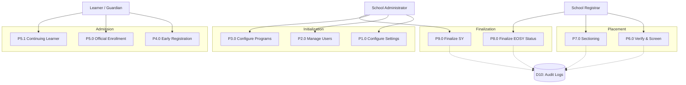

# EnrollPro - Data Flow Diagram (DFD) Guide

This document outlines the logical flow of information through the EnrollPro system. It maps the conceptual data stores to physical database models and describes the core processes for learners, registrars, and administrators within the Hinigaran National High School (HNHS) ecosystem.

---

## 1. Data Stores to Database Mapping

The system utilizes the following data stores, which map directly to our physical Prisma ORM models:

| ID | Data Store Name | Physical Database Tables (Prisma Models) | Description |
| :--- | :--- | :--- | :--- |
| **D1** | **System Configs** | `school_settings`, `school_years`, `sections`, `teachers`, `users`, `scp_program_configs`, `scp_program_steps`, `scp_interview_rubric_categories` | Global parameters, SY dates, teacher master list, and Special Program (STE, SPA) assessment pipelines. |
| **D2** | **Applications** | `early_registration_applications`, `early_registration_assessments`, `application_addresses`, `application_family_members` | Phase 1 Early Registration demographics, LRN, family profiles, and screening scores. |
| **D3** | **Enrollment Records** | `enrollment_applications`, `application_checklists`, `enrollment_previous_schools`, `enrollment_program_details` | Phase 2 Official Enrollment (BEEF) data and physical document checklist statuses. |
| **D4** | **Placements** | `enrollment_records` | Finalized mappings of students to their assigned sections for the current SY. |
| **D5** | **Audit & Monitoring** | `audit_logs` | Strict immutable tracking of all administrative and registrar actions for DPA compliance. |

---

## 2. Level 1 DFD: Sequential Lifecycle Processes (P1.0 - P9.0)

EnrollPro operates through nine primary processes aligned with DepEd enrollment cycles.

### Phase A: System Initialization (Admin)
*   **P1.0 Configure School Settings:** Setup SY dates and portal windows (D8, D9).
*   **P2.0 Manage Users & Access:** Assign RBAC roles to Registrars and encode Faculty master lists (D11, D12, D13).
*   **P3.0 Configure Special Programs:** Define screening rubrics for STE/SPA programs (D14, D15, D16).

### Phase B: Admission & Enrollment (Learner)
*   **P4.0 Submit Early Registration:** Learners provide LRN, demographics, and BEEF data (D1, D2, D3).
*   **P5.0 Submit Official Enrollment:** Learners confirm intent and provide academic history (D4, D5, D6).
*   **P5.1 Submit Continuing Learner Confirmation:** Existing learners confirm intent for the upcoming school year using their previous data.

### Phase C: Verification & Placement (Registrar)
*   **P6.0 Verify & Screen Applications:** Registrar physically verifies "Brown Envelope" documents and encodes screening scores (D7, D1, D18). **Requires Audit Logging (D10).**
*   **P7.0 Manage Sectioning & Enrollment:** Final placement of learners into sections based on program and capacity (D17, D4, D19). **Requires Audit Logging (D10).**

### Phase D: EOSY Finalization (Registrar/Admin)
*   **P8.0 Finalize EOSY Promotional Status:** Registrar manually encodes or uploads final grades and promotional statuses (Promoted/Retained) (D17, D19). **Requires Audit Logging (D10).**
*   **P9.0 Finalize School Year:** Admin locks SY and exports LIS-ready CSV reports (D9, D17). **Requires Audit Logging (D10).**

---

## 3. Visual DFD Level 1 (High-Level Overview)

